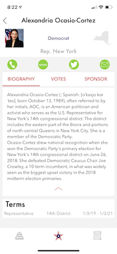
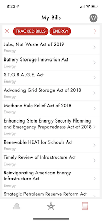

# Kratos API

[Kratos](https://getkratos.com/) is a platform for people to keep-up with how their elected officials are representing them in congress.

This Elixir-based API pulls voting and bill data from various U.S. Government open data sources and normalizes everything with standardized schemas to allow modern tracking of any elected representative's voting record.

## Screenshots

This API was co-developed with a [companion iOS app](https://apps.apple.com/us/app/kratos-build-your-democracy/id1198595150). The screenshots below illustrate some of the data and features available from the API.

The API allows quick location-based lookup of a user's current congressional district and the elected representatives for that district.

From there, using normalized `ids` for each representative, it's easy to see more information about any current elected official.

Including viewing a representatives voting record and all the bills they have sponsored.

Every bill in congress can have multiple votes and it's easy to get a high-level overview of the amendments and changes.

And the API provides the most important data — how every elected official voted on the specific bill.

The API also supports user tracking of specific bills to better reveal all the votes and how a bill becomes a law.

## Future

This API powers an [iOS app that is available for free](https://apps.apple.com/us/app/kratos-build-your-democracy/id1198595150). The voting and bill data continues to be updated but there's no further feature improvements at this time.

## Development

### Start server

    $ mix phoenix.server

### Tests

    $ mix test

### Generate Documentation

API documentation uses the [api blueprint](https://apiblueprint.org/) standard.

    $ npm run doc

### Deploy

Deployment uses edeliver.

    $ mix edeliver build release

    $ mix edeliver deploy release

    $ mix edeliver restart
